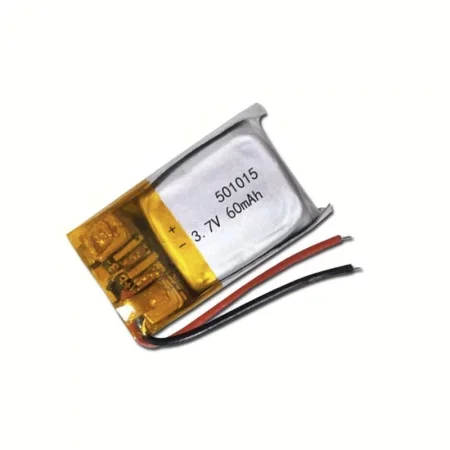

*The cover image was generated using a neural network to demonstrate how well it understands why are wireless earphones called wireless…*

I like to think that I am not a severe overthinker, so I have naturally let the thought slip and wasted no more time with such nonsense. Now seriously, why are people not afraid? Everybody knows smartphones do explode quite sometimes and there is a good reason why [you are not allowed to bring power banks and other electronic devices with lithium-ion batteries on an airplane](https://www.tsa.gov/travel/security-screening/whatcanibring/items/power-banks) (you can often bring them on board, but there they are limited by other factors).

Why should wireless earphones explode in the first place you ask me? Because, like any [portable electronics](https://www.tesla.com/models) we use nowadays, they use lithium-ion batteries which do explode. (If you want to learn more about li-ion batteries, I suggest [this video](https://www.youtube.com/watch?v=G5McJw4KkG8)). Since the manufacturers do not want their customers to blow up (at least some of them), batteries that are part of electronic devices have a custom controller that regulates the voltage, which in theory protects them from overheating (that is what leads to explosions). Nothing is perfect though.

As I was scouring the internet to learn more about this, I found this [reddit thread](https://www.reddit.com/r/NoStupidQuestions/comments/17h14gc/why_are_people_not_afraid_of_wireless_earbuds/) where somebody had the same question as I did. Aside from this comment (by which I totally do not feel attacked)

>   Because they don’t have anxiety disorders.

the people there agreed that it is because it does not actually happen. It is too rare.

That is true, it does not have a big media coverage and I do not personally know any victim of it and imagine how many people worldwide use them daily. But it [does happen](https://www.indiatvnews.com/technology/news/samsung-earbuds-explode-in-woman-s-ear-are-you-at-risk-2024-09-26-954046). I was originally thinking only about earbuds, but there are also [wireless headphones](https://www.youtube.com/watch?v=PdZsOKL0yQc) that are much bigger (which means they can fit inside a bigger battery). Honestly I am still unsure what the difference between earbuds, earphones, headphones and whatever other phones and buds exist is, but let us put that aside now.

I started with thinking that people simply do not understand [how wireless earphones work](https://www.youtube.com/watch?v=_ZKNOKHpqE4), but it does not take much brains to realise they must have a power supply (a battery). Maybe then, people do not know that batteries can explode, but I am not buying that either.

Another opinion I read is that while wireless earphones are basically a bomb inside your head, it is a small bomb and it was not designed as such, so the casing actually protects you from the explosion, which means the impact would not be that severe. Before I say anything else, [this article](https://www.republicworld.com/india/rajasthan-28-year-old-man-dies-after-bluetooth-headphones-explode-while-in-use) claims somebody *dying*, because their headphones went boom while still on their head. Things that happen in India need to be taken with a grain of salt though.

It is true that the batteries inside wireless earhphones (or earbuds? – you know what I mean) are quite small (in both size and capacity). While smartphone batteries have 3000-6000 mAh of capacity (you do not need to understand [what it means](https://www.sciencedirect.com/topics/engineering/battery-capacity)), wireless earphones have around 40-60 mAh. That is really only enough to supply a speaker for a few hours, I am still amazed it manages a Bluetooth connection at the same time. For the record, car batteries can have 40-100 Ah (where Ah is a thousand times bigger unit than mAh, for those who skipped physics).

To get to the fun part, I searched YouTube for how it looks when a li-ion battery actually explodes. It is [pretty impressive](https://www.youtube.com/watch?v=iDaPP-dI9dE), honestly. It is also good to note that the battery does not always explode, sometimes it just [catches fire](https://www.youtube.com/watch?v=oieH2wwDGzo) (inside your ears). Among the things that happen with li-ion batteries, I did not see [this](https://youtu.be/sAQlLu5ttOk?t=80) comming. I always thought it was anti-Elon propaganda.

The most relevant video I found is [this](https://www.youtube.com/watch?v=HCGtRgBUHX8). The battery displayed is closest to the smartphone and earphones and IoT and other batteries that are in the portable electronics. It is much bigger than a battery that could realistically be in the earphones. By my educated guess (I recently finished high school), it can be something around 500 mAh. This is what a 60 mAh li-ion battery looks like for reference.

source: [https://ampul.eu/cs/baterie/4453-li-pol-baterie-60mah-37v-501015](https://ampul.eu/cs/baterie/4453-li-pol-baterie-60mah-37v-501015)

I know you can not see it from the picture, but it is really tiny. Remember it has to fit in your ear. That means that the explosion would be let us say eight times weaker than the one in the video. I never owned wireless earphones, but I suppose the casing is mostly plastic, because everything nowadays is plastic, [even newborns](https://www.sciencedirect.com/science/article/pii/S0160412020322297?via%3Dihub). By my calculations, plastic is not a good protection against an explosion, because it melts (in your ear). That being said, I would expect exploding earphone to cause deafness, possibly permanent, if nothing worse. That is the case in many of incidents covered by media. However, people do not want to be deaf, they just do not want to listen. What is it then?

I have the bad feeling that you came here out of curiosity, but stayed for an answer. If that is the case, I feel good about myself when I tell you I do not have one. My assumption is that the majority of people do not think about the inner workings of their earphones at all. They are there for the music, not for drama. The thought simply never comes to them that there might be something wrong with using wireless earphones (I am not saying there is (though there is)).

Moreover, wireless earphones do not explode very much. If you calculated the ratio between the incidents and total users, it would be so small that most standard calculators would simply show zero, because they do not have enough memory to hold so many decimal places.

Also, even when we know that something happened to someone (which is a proof that it can happen), we almost never seriously think it could happen to us. Do you think the people who got cancer thought they are going to get cancer? They probably thought that it happens to other people, but not them.

The only way to find out for certain would be to make a survey among the population, but that takes time and my generation (me included) is all for instant gratification. I am not doing that. All things considered, the answer might as well be that *people do not have anxiety disorders*.
